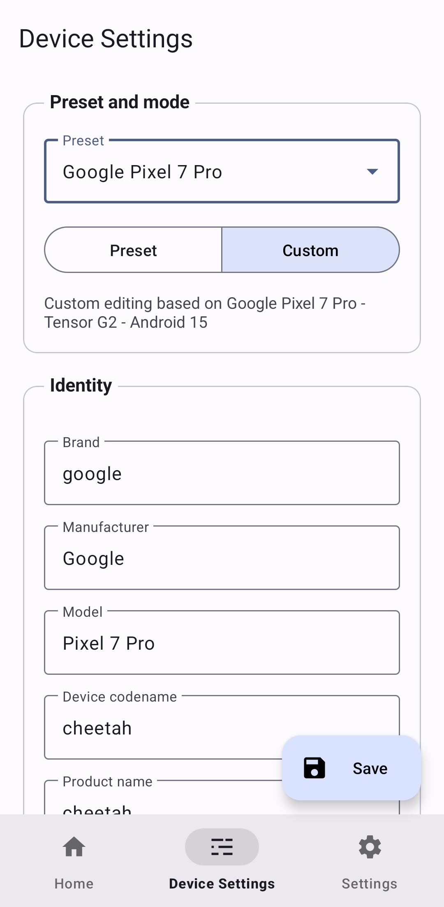

# SpoofMyDevice

SpoofMyDevice is an LSPosed companion app for building, saving, and applying spoofed Android device profiles with a clean Material 3 interface.

Instead of manually editing property files, you can pick a preset, switch to a custom profile, save it, and let the module apply those values to scoped apps at runtime.

## Preview

<div>



</div>

## Features

- Material 3 companion app designed for day-to-day profile management
- Home dashboard with module status, active spoof profile, and config file details
- Built-in device presets for Pixel, Galaxy, Xiaomi, tablet profiles, and more
- Custom mode that starts from a preset and keeps every value editable
- Runtime settings for theme, language, system colors, and optional display spoofing
- App Info page with version details, credits, and project link
- Config-based workflow that keeps the hook layer and UI in sync

## Requirements

- Android 8.0 or higher
- Rooted device with LSPosed installed
- Target apps added to LSPosed scope

## What It Can Spoof

SpoofMyDevice is built to control the values that apps commonly inspect when identifying a device:

- `Build.*` fields such as brand, manufacturer, model, device, board, fingerprint, release, and SDK
- System properties used by apps that read values outside normal Android APIs
- Telephony and carrier-related values
- Optional display metrics like resolution and density

The companion app saves the selected profile, and the LSPosed module applies those values when scoped apps are launched.

## Presets And Custom Profiles

The app supports two profile workflows:

1. `Preset`
   Use a ready-made device profile from the built-in catalog.

2. `Custom`
   Start from a preset, keep its values, and edit whatever you need.

This makes it easy to use a known-good base profile and only tweak the parts that matter for your target app.

## How To Use

1. Install the app on your device
2. Open it once so the initial config file can be created
3. Enable the module in LSPosed
4. Add the apps you want to spoof to LSPosed scope
5. Pick a preset or switch to a custom profile
6. Tap `Save`
7. Force stop and relaunch the target apps

## App Settings

The companion app also includes a few quality-of-life settings:

- English, Korean, or Japanese UI

## Config File

Profiles are stored as a simple `key=value` config file so the UI and hook layer can share the same source of truth.

The module reads that saved config and reapplies it to scoped apps when they start.

## Build From Source

```bash
git clone https://github.com/BuSung-dev/SpoofMyDevice.git
cd SpoofMyDevice
./gradlew assembleDebug
```

The debug APK will be generated at:

```text
app/build/outputs/apk/debug/app-debug.apk
```

## Notes

- The current install package name is `com.spoofmydevice`
- If you change package name between builds, Android treats it as a separate app install
- Some apps cache device information aggressively, so a force stop may be required after saving

## Disclaimer

This project is intended for research, testing, and authorized use only. Make sure your use complies with local laws, platform rules, and the policies of the apps you test.
